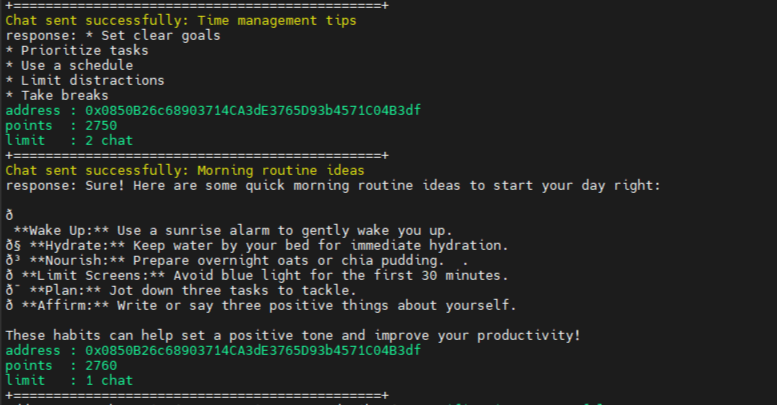

# KlokApp / MIRA Auto Bot
<p align="center">
    
</p>

*KlokApp Auto Bot is an automation script to earning point from send chat to AI platform, such as Daily and referrer*

- Register : [HERE](https://klokapp.ai?referral_code=L7USVPYL)

## Features
1. **Auto Chat (Daily)**: Send chat to AI repeat 24 Hours.
2. **Add Refferer**: Perform automatic mining to earn points.
3. **Saving Referrer Accounts**: Auto save referrer account into assets/klok_{your_referrer_code}.txt
4. **Free Bypass Features**: Bypassing ReCaptcha V3 Free

## Requirements
- Python 3.8 or latest

## Installation
1. Clone this repository:
   ```bash
   git clone https://github.com/realfx24/klokapp.git
   cd klokapp
   ```

2. Activate Virtual Environment (Required for VPS):
   ```bash
   python3 -m venv env
   source env/bin/activate
   ```

3. Install dependencies (if error using Virtual Environment):
   ```bash
   pip install -r requirements.txt
   ```

## Configuration
1. enter your private key into config/private_key.txt like this
   ```bash
    private_key_1
    private_key_2
    private_key_3
   ```

2. Fill your referral code in config/ref_code.txt like this (dont input link)
   ```bash
   referral_code1
   referral_code2
   referral_code3
   ```

## How to use
Run the main script:
   ```bash
   python main.py
   ```
   if in VPS or Linux:
   ```bash
   python3 main.py
   ```
## Output Example
<p align="center">
    
</p>

## Dependencies
- **Web3** – A Python library for interacting with the Ethereum blockchain. It is used to send transactions, interact with smart contracts, and connect to Ethereum nodes via HTTP or WebSocket protocols.
- **eth_account** – A submodule of Web3.py for managing Ethereum accounts. It allows for account creation, signing transactions or messages, and verifying digital signatures.
- **Colorama** – A Python library that adds color to terminal output, making logs and messages more readable. It works across platforms including Windows, Linux, and macOS.
- **Requests** – A simple yet powerful HTTP library for Python. It is commonly used to send HTTP requests (GET, POST, etc.) and interact with RESTful APIs easily and efficiently.
